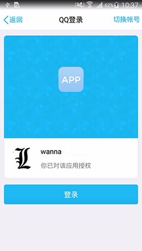
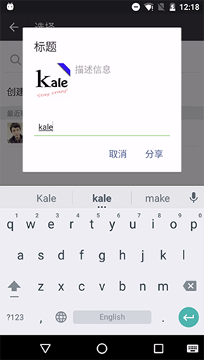
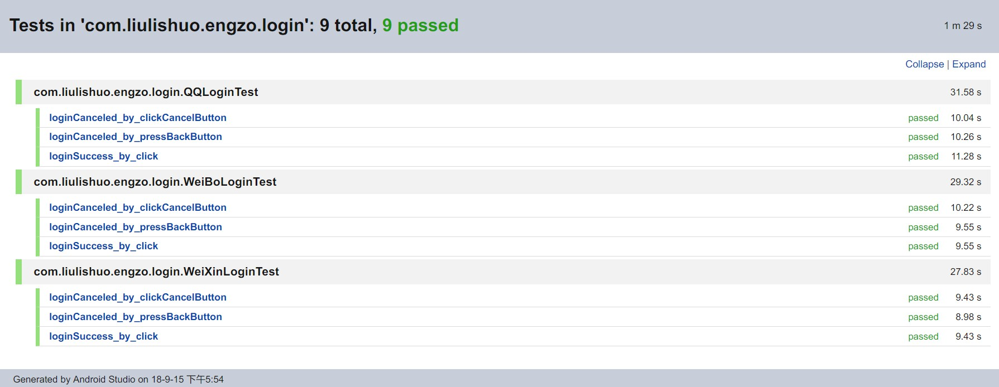

# ShareLoginLib   
[](https://jitpack.io/#tianzhijiexian/ShareLoginLib)  

ShareLoginLib是一个类似于友盟的shareSDK的第三方登录、分享库。这个库可以在保证代码高质量和稳定性的同时，帮助开发者们实现QQ、微博、微信等平台的登录和分享功能。


## 示例
  

## 添加依赖

1.在项目外层的build.gradle中添加JitPack仓库

```
repositories {
  // ...
  maven {
    url "https://jitpack.io"
  }
  maven { url "https://dl.bintray.com/thelasterstar/maven/" }
}
```

2.在用到的项目中添加依赖  

**如果你用的是1.+的版本，即1.3.9之前**

>	implementation 'com.github.tianzhijiexian:ShareLoginLib:【你目前的版本】

> implementation 'com.github.tianzhijiexian:ShareLoginLib:adapter-SNAPSHOT'

**如果你用的是2.+的版本**

> implementation 'com.github.tianzhijiexian:ShareLoginLib:[Latest release](https://github.com/tianzhijiexian/ShareLoginLib/releases/latest) (<- click it)

3.支持java8语法

```
compileOptions {
  sourceCompatibility JavaVersion.VERSION_1_8
  targetCompatibility JavaVersion.VERSION_1_8 
}
```

## 配置（库版本1.+）

### 1. 在build.gradle中配置QQ的key  

```java
defaultConfig {
    applicationId "xxx.xxx.xxx" // 你的app包名
    
     // tencent+你的AppId
    manifestPlaceholders = ["tencentAuthId": "tencent123456"]
}
```

### 2. 在使用功能前配置常量

 ```java
SlConfig config = new SlConfig.Builder()
            .debug(false)
            .appName("Your App Name")
            .picTempFile(null) // 缓存缩略图的目录，如无特殊要求可以是null
            .qq(qq_app_id, qq_scope)
            .weiBo(weibo_app_key, weibo_redirect_url, weibo_scope)
            .weiXin(weixin_app_id, weixin_secret)
            .build();

ShareLoginSDK.init(this, config);
```

```java
/**
 * 初始化一些常量，这里的scope请根据第三方的文档进行定制
*/ 
protected void initConstant() {
    qq_app_id = "xxxxxxxxxxxx";
    qq_scope = "get_user_info,"
    + "get_simple_userinfo,"
    + "add_share,"
    + "add_topic,"
    + "add_pic_t";    
    
    weibo_app_key = "xxxxxxxxxxxx";
    weibo_redirect_url = "xxxxxxxxxxxx";
    weibo_scope = "friendships_groups_read,"
    + "friendships_groups_write,"
    + "statuses_to_me_read,"
    + "follow_app_official_microblog";    
    
    weixin_app_id = "xxxxxxxxxxxx";
    weixin_secret = "xxxxxxxxxxxx"; 
}
```

## 使用（库版本1.+）

### 判断是否已安装第三方客户端  

```java
ShareLoginSDK.isQQInstalled(this);
ShareLoginSDK.isWeiBoInstalled(this);
ShareLoginSDK.isWeiXinInstalled(this);
```

### 登录

登录操作会根据`SsoLoginType.XX`来区分平台，可选的类型有：

```java
public @interface SsoLoginType {

    String QQ = "QQ", WEIBO = "WEIBO", WEIXIN = "WEIXIN"; 
}
```

执行QQ登录（举例）：

```java
SsoLoginManager.login(this, SsoLoginType.QQ, new SsoLoginManager.LoginListener() {
    @Override
  public void onSuccess(String accessToken, String uId, long expiresIn, @Nullable String wholeData) {
        super.onSuccess(accessToken, uId, expiresIn, wholeData);
  }
});
```

*这里的监听器可以监听到登录成功、登录失败、取消登录等情况，请根据需要进行实现。*

得到QQ用户的详细信息（举例）：

在**1.+版本**中用户登录和获得用户信息是两个流程，登录成功后会得到token，我们需要用这个token来得到用户的具体信息。

```java
SsoUserInfoManager.getUserInfo(context, SsoLoginType.QQ, accessToken, userId,
    new UserInfoListener() {

        public void onSuccess(@NonNull OAuthUserInfo userInfo) {
            // 可以得到：昵称、性别、头像、用户id
        }

        public void onError(String errorMsg) {
        }
    });
```

更多详细的操作请参考adapter分支中的app项目。

### 分享

目前分享操作支持分享纯文字，单张图片和富文本网页三种类型，分别对应的类为：

1. ShareContentText
2. ShareContentPic
3. ShareContentWebPage

说明：上述类型都是ShareContent的子类。

执行分享给QQ好友的操作（举例）：

```java
ShareContent shareContent = new ShareContentWebPage("title", "summary", "http://www.kale.com", bitmap); 

SsoShareManager.share(this, SsoShareType.QQ_FRIEND, shareContent, new SsoShareManager.ShareStateListener(){
    @Override
  protected void onComplete() {
        super.onComplete();
  }
});
```

*这里的监听器可以监听到用户分享完成、取消分享和分享异常等情况，请根据需要进行实现。*

## 测试

### 测试环境

1. 未安装第三方app
2. 开启不保留活动，并且第三方app已经登录
3. 安装了第三方app，但第三方app未登录
4. 安装了第三方app，第三方app已经登录完毕

### 测试用例

TABLE | 用户授权 > 登录成功 | 用户取消 > 登录取消 | 用户按Back键取消 > 登录取消
-- | -- | -- | --
QQ |  ✓  |✓|✓
微博 |  ✓  |✓|    ✓
微信|  ✓  | ✓ |  ✓

TABLE | 用户分享 > 分享成功 |分享后留在目标App后返回 > 分享成功| 用户取消 > 分享取消
-- | -- | -- | --
QQ |  ✓  |✓|✓
微博 |  ✓  |--|    ✓
微信|  ✓  | ✓ |  ✓（取消也会是成功的回调）

TABLE | 分享纯文本 |分享单张图片| 分享富文本网页
-- | -- | -- | --
QQ好友 |  X  | ✓ | ✓
QQ空间|  ✓  |  ✓  |   ✓
微博 |  ✓  |✓|    ✓
微博故事|  X  |  ✓  |   X
微信|  ✓  | ✓ |  ✓（取消也会是成功的回调）
微信朋友圈|  ✓  |  ✓  |   ✓（取消也会是成功的回调）
微信收藏|   ✓  |   ✓  |   ✓（取消也会是成功的回调）

### 自动化测试

测试代码：

https://github.com/tianzhijiexian/ShareLoginLib/tree/master/app/src/androidTest/java/com/liulishuo/engzo

执行结果：



http://t.cn/EvcxDMx   
http://t.cn/EvfKPR9

## 运行本库提供的Demo

如果你要运行本项目给出的demo，那么可以修改本地的`gradle.properties`文件，将下列信息修改成你自己的值。   

```
STORE_FILE_PATH  ../test_key.jks 
STORE_PASSWORD   test123 
KEY_ALIAS        kale 
KEY_PASSWORD     test123 
PACKAGE_NAME     com.liulishuo.engzo 
TENCENT_AUTHID   tencent123456
```

你可以运行debug或release模式，可以测试开启混淆前和混淆后的情况。千万不要使用demo中的任何和签名、密码、AppId等有关信息。

## 重要说明

- 需要强制获取外部存储卡的权限，否则会拿不到分享的图片
- 签名后的app才可以进行测试，否则会无法的登录和分享
- 使用者要在第三方平台进行注册后才可进行测试
- 部分手机上需要读取手机app列表的权限

更多已知bug请参考：https://github.com/tianzhijiexian/ShareLoginLib/issues/7

## LICENCE

  The MIT License (MIT)

  Copyright (c) 2015-2019 kale Inc.
